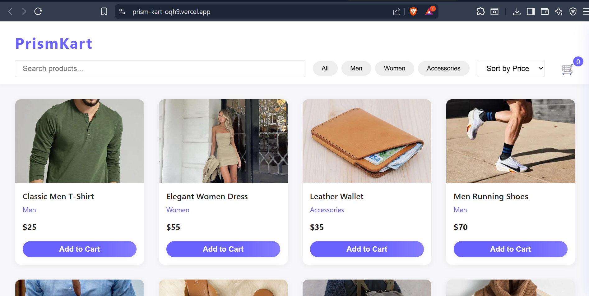

<h3> PrismKart Product Listing Page</h3>

A responsive, interactive product listing page for the PrismKart e-commerce demo. Users can search, filter by category, and sort products by price — all with pure front-end JavaScript.

## Features
- Product grid with images, titles, prices, and categories
- Real-time search bar
- Category filter buttons (Men, Women, Accessories)
- Price sorting (Low → High, High → Low)
- Responsive design (Grid/Flexbox)
- Modal popup for product details

## Screenshot

## Live Demo
[View Live](https://prism-kart-oqh9.vercel.app/)

## How to Run
1. Download or clone this repository.
2. Open `index.html` in your browser.

## Add to Cart Functionality

This project now includes a fully frontend cart system:

- Each product card has an "Add to Cart" button.
- Click the cart icon (🛒) in the header to open the cart sidebar.
- The cart shows all selected items, their quantity, and the total price.
- Remove items from the cart with the ❌ button.
- Cart state is managed entirely in the browser (no backend required).

**How to use:**
1. Browse the product grid.
2. Click "Add to Cart" on any product.
3. Open the cart from the header to view or remove items.

